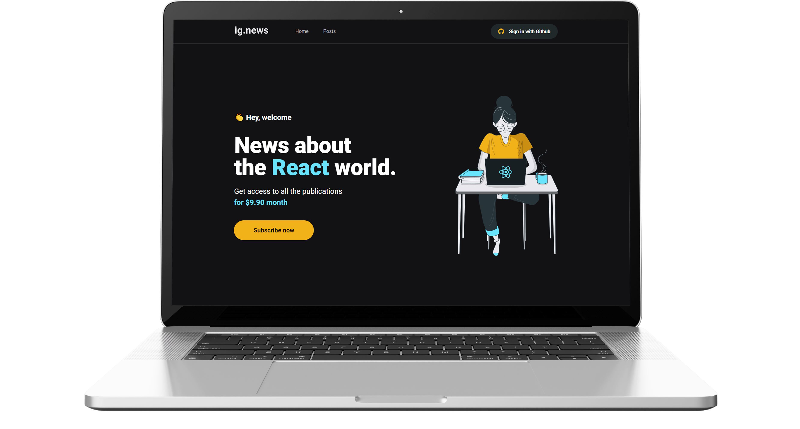

<h1 align="center"> 🚧 Ignews 🚧</h1>
<h3 align="center">
  Blog using NextJS
</h3>

<p align="center">
  <a href="#%EF%B8%8F-about-the-project">About the project</a>&nbsp;&nbsp;&nbsp;|&nbsp;&nbsp;&nbsp;
  <a href="#-technologies">Technologies</a>&nbsp;&nbsp;&nbsp;|&nbsp;&nbsp;&nbsp;
  <a href="#-getting-started">Getting started</a>

<p align="center">
  
</p>


## 📄 About the project

Ignews is a website to publish about technology and receive all the news by subscription using Stripe payment. 

**Ignews is a website developed during Ignite Bootcamp focused to learn the best use of NextJS.**


## 💻 Technologies

Technologies that I used to develop this website:

<p>
  <a href="https://nextjs.org/">NextJS</a>&nbsp;&nbsp;&nbsp;|&nbsp;&nbsp;&nbsp;
  <a href="https://www.typescriptlang.org/">Typescript</a>&nbsp;&nbsp;&nbsp;|&nbsp;&nbsp;&nbsp;
  <a href="https://sass-lang.com/">Sass</a>&nbsp;&nbsp;&nbsp;|&nbsp;&nbsp;&nbsp;
  <a href="https://fauna.com/">FaunaDB</a>&nbsp;&nbsp;&nbsp;|&nbsp;&nbsp;&nbsp;
  <a href="https://stripe.com/br">Stripe</a>&nbsp;&nbsp;&nbsp;
</p>


## 💻 Getting started

**Clone the project and access the folder**

```bash
$ git clone https://github.com/eryson/ignite-ig-news && cd ignite-ig-news
```

**Then install the dependencies**

```bash
# Create .env.local file with the keys:
# Stripe keys
# Github client keys
# FaunaDB key

# Install the dependencies
$ yarn

# Start the client
$ yarn dev
```

## 📝 License

Not specified.
